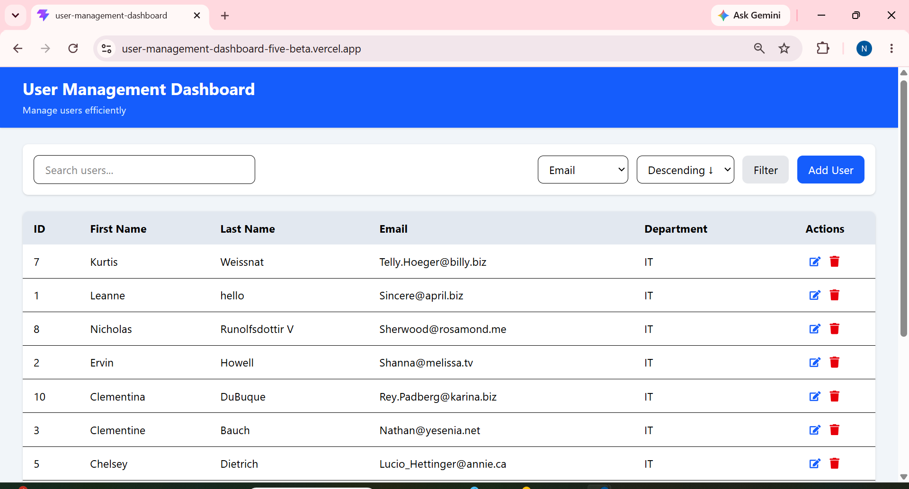
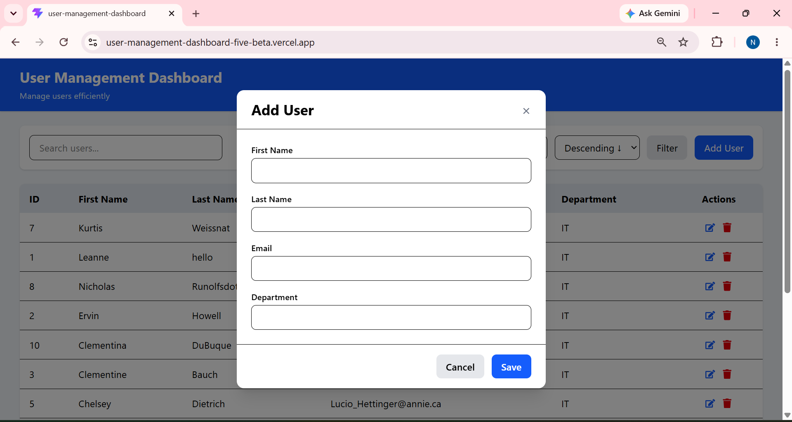
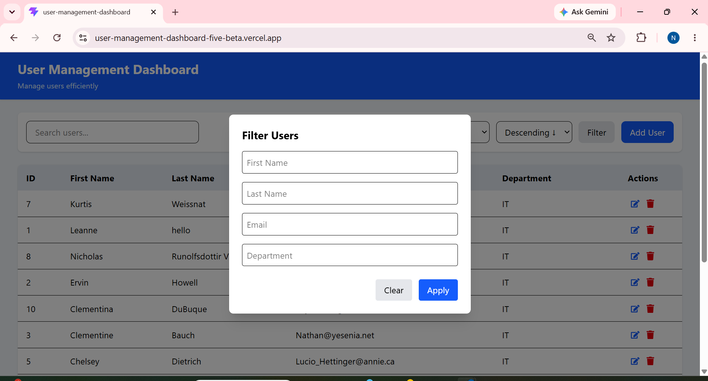

# 👥 User Management Dashboard

<p align="center">

<a href="https://user-management-dashboard-five-beta.vercel.app/">

</a>

<a href="https://github.com/Neha6383/user-management-dashboard">

</a>

</p>

<p align="center">
A responsive user management application built with React 19, Vite and Tailwind CSS, featuring CRUD operations, search, filtering, sorting, pagination and form validation.
</p>

---

## 🌐 Live Demo

### 👉 [Open User Management Dashboard](https://user-management-dashboard-five-beta.vercel.app/)

> **Demo note:** The application uses JSONPlaceholder as a mock REST API. Create, update and delete operations are simulated and are not permanently persisted by the API.

---

## 📸 Screenshots

### 📊 Dashboard

<p align="center">
  
</p>

### ➕ Add User

<p align="center">
  
</p>

### 🔎 Filter Users

<p align="center">
  
</p>

---

## ✨ Features

### 👥 User Management

* View user records from a REST API
* Add new users
* Edit existing users
* Delete users
* Responsive user table

### 🔎 Search & Filtering

* Search by:

  * First name
  * Last name
  * Email
  * Department
* Filter user records
* Sort user data
* Combine search, filtering and sorting with pagination

### 📄 Pagination

Supports:

* 10 records per page
* 25 records per page
* 50 records per page
* 100 records per page

Pagination is implemented on the client side.

### ✅ Form Validation

User forms are validated using:

* React Hook Form
* Zod

Validation currently covers:

* First Name
* Last Name
* Email
* Department

### 🔔 User Feedback

The application provides:

* Success notifications
* Error handling
* Validation feedback
* Responsive UI states

---

## 🧠 Engineering Highlights

This project was structured with maintainability and separation of concerns in mind.

### Component Architecture

The application separates reusable UI functionality into dedicated components:

```text
src/
├── api/
├── components/
│   ├── common/
│   ├── filter/
│   ├── layout/
│   ├── modal/
│   ├── pagination/
│   ├── search/
│   └── table/
├── constants/
├── hooks/
├── pages/
├── schemas/
├── services/
└── utils/
```

This structure keeps UI components, API communication, validation schemas, hooks and utility logic separated instead of placing application logic in a single component.

---

## 🏗️ Application Flow

```text
                    ┌─────────────────────┐
                    │     React UI        │
                    │                     │
                    │ Dashboard / Table   │
                    │ Search / Filter     │
                    │ Add / Edit / Delete │
                    └──────────┬──────────┘
                               │
                               ▼
                    ┌─────────────────────┐
                    │ Reusable Components │
                    │                     │
                    │ Table / Modal       │
                    │ Search / Filter     │
                    │ Pagination          │
                    └──────────┬──────────┘
                               │
                               ▼
                    ┌─────────────────────┐
                    │ API / Service Layer │
                    │                     │
                    │ Axios               │
                    └──────────┬──────────┘
                               │
                               ▼
                    ┌─────────────────────┐
                    │ JSONPlaceholder API │
                    │                     │
                    │ /users              │
                    └─────────────────────┘
```

---

## 🛠️ Tech Stack

### Frontend

### Forms & Validation

### API

### Deployment

---

## 🔌 API

This application consumes the **JSONPlaceholder Users API**:

`https://jsonplaceholder.typicode.com/users`

The API is used to simulate user CRUD operations.

Because JSONPlaceholder is a mock API, changes made through the application are not permanently stored.

---

## ⚠️ API Limitation

JSONPlaceholder simulates create, update and delete requests but does not provide persistent storage.

Therefore:

```text
Add User
   ↓
API request succeeds
   ↓
User appears in UI
   ↓
Page refresh
   ↓
Mock API data is restored
```

A production implementation would replace the mock API with a persistent backend and database.

---

## 🧪 Validation

Zod + React Hook Form are used to validate user input.

Current validation covers:

| Field      | Validation         |
| ---------- | ------------------ |
| First Name | Required           |
| Last Name  | Required           |
| Email      | Valid email format |
| Department | Required           |

---

## 🚀 Getting Started

### 1. Clone the repository

```bash
git clone https://github.com/Neha6383/user-management-dashboard.git
```

### 2. Navigate into the project

```bash
cd user-management-dashboard
```

### 3. Install dependencies

```bash
npm install
```

### 4. Start the development server

```bash
npm run dev
```

The application will be available at the local development URL shown by Vite.

---

## 📦 Production Build

Create a production build with:

```bash
npm run build
```

---

## 🧪 Testing

The project includes Vitest configuration for frontend testing.

Run the test suite with:

```bash
npm run test
```

> If the `test` script is not currently defined in `package.json`, add/configure it before publishing this command.

---

## 📁 Project Structure

```text
user-management-dashboard/
│
├── public/
│
├── screenshots/
│
├── src/
│   ├── api/
│   ├── components/
│   │   ├── common/
│   │   ├── filter/
│   │   ├── layout/
│   │   ├── modal/
│   │   ├── pagination/
│   │   ├── search/
│   │   └── table/
│   │
│   ├── constants/
│   ├── hooks/
│   ├── pages/
│   ├── schemas/
│   ├── services/
│   └── utils/
│
├── .gitignore
├── index.html
├── package.json
├── package-lock.json
├── vite.config.js
└── vitest.config.js
```

---

## 🔍 Key Challenges

### 1. Combining multiple table operations

Search, filtering, sorting and pagination need to work together without producing inconsistent results.

### 2. Handling different user data states

The application handles users returned from the API as well as users created through the UI.

### 3. Mock API behavior

Because JSONPlaceholder does not persist mutations, the frontend needs to handle the distinction between simulated API responses and persistent data.

### 4. Component Reusability

The UI was divided into reusable components for areas such as:

* Tables
* Search
* Filtering
* Pagination
* Modals
* Layout
* Common UI elements

---

## 🔮 Future Improvements

* [ ] Replace JSONPlaceholder with a persistent backend
* [ ] Add PostgreSQL or MongoDB persistence
* [ ] Implement authentication
* [ ] Add role-based authorization
* [ ] Move pagination and filtering to the backend
* [ ] Add user profile pages
* [ ] Add dark mode
* [ ] Add CSV/PDF export
* [ ] Expand automated test coverage
* [ ] Add CI/CD pipeline

---

## 📈 Project Focus

This project demonstrates practical experience with:

`React` · `REST APIs` · `CRUD` · `Component Architecture` · `Form Validation` · `API Integration` · `Responsive UI` · `Client-side Data Processing`

---

## 👩‍💻 Author

**Neha Sharma**

Software Engineering Intern • Full-Stack Developer

### Connect with me
